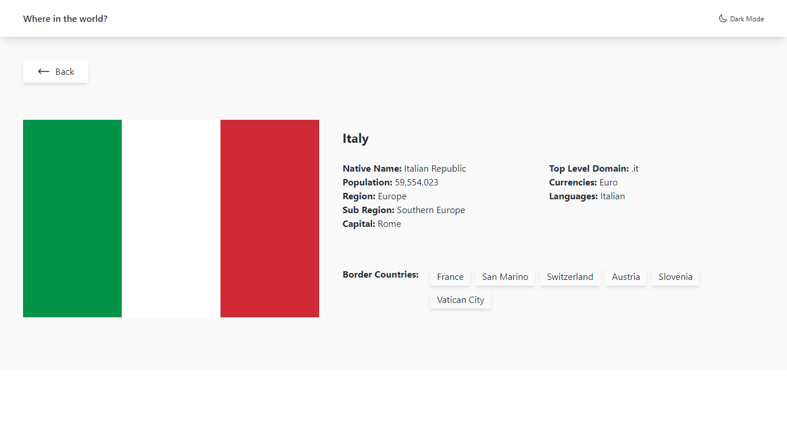
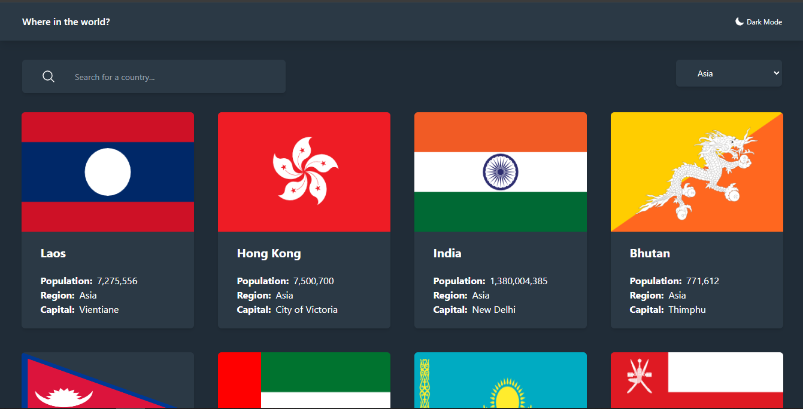
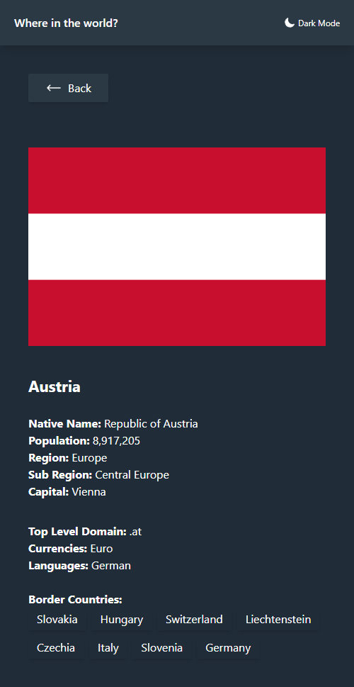

# REST Countries API with Color Theme Switcher

Project ini berdasarkan pada challenge di Frontend Mentor [REST Countries API with Color Theme Switcher](https://www.frontendmentor.io/challenges/rest-countries-api-with-color-theme-switcher-5cacc469fec04111f7b848ca/hub).

## Daftar Isi

- [Overview](#overview)
  - [Penjelasan Project](#the-challenge)
  - [Screenshot](#screenshot)
  - [Links](#links)
- [Proses](#proses)
  - [Stack yang digunakan](#stack-yang-digunakan)
  - [Resources](#resources)
- [Author](#author)

## Overview

### Penjelasan Project

Pada project ini saya membangun Countries App yang menampilkan data dan informasi 250 negara. Data diambil dari [REST Countries API](https://restcountries.com/).
Fokus utama pada project ini adalah membuat tampilan semirip mungkin dengan desain yang diberikan oleh Frontend Mentor.

### Screenshot

**Tampilan Desktop**

**Tampilan Mobile** 

### Links

- Solution URL: [Solution Code](https://github.com/abimh66/rest-countries)
- Live Site URL: [Live Site](https://rest-countries-abimh66.netlify.app/)

## Proses

### Stack yang digunakan

- Vue
- Vue Router
- [VueUse](https://vueuse.org/)
- [Tailwind CSS](https://tailwindcss.com/)
- Flexbox
- Mobile-first workflow

### Resources

- [Vue Documentation](https://vuejs.org/)
- [Tailwind CSS Documentation](https://tailwindcss.com/docs/installation)
- [Mozilla MDN JavaScript Documentation](https://developer.mozilla.org/en-US/docs/Web/JavaScript)

## Author

- Frontend Mentor - [@abimh66](https://www.frontendmentor.io/profile/abimh66)
- Codewars - [@abimh66](https://www.codewars.com/users/abimh66)
- Twitter - [@abimhrdnt](https://www.twitter.com/abimhrdnt)
